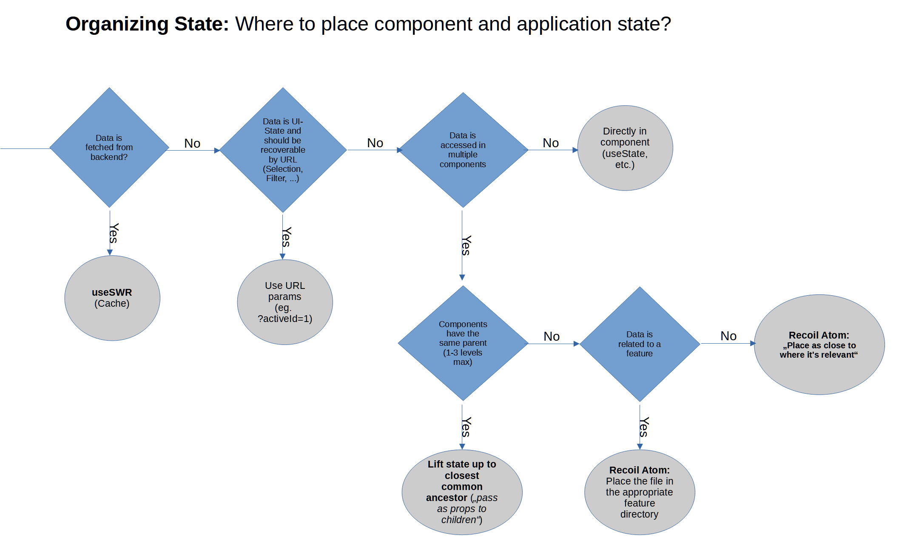

<!-- PROJECT LOGO -->
<br />
<p align="center">
  <h1 align="center">innFactory-React-Template</h3>
</p>

### Built With

-   [React](https://reactjs.org/)
-   [Create React App](https://github.com/facebook/create-react-app)
-   [swr](https://github.com/vercel/swr)
-   [Recoil](https://github.com/facebookexperimental/Recoil)
-   [Formik](https://github.com/formium/formik)
-   [react-typesafe-routes](https://github.com/innFactory/react-typesafe-routes)
-   [react-error-boundary](https://github.com/bvaughn/react-error-boundary)
-   [i18next](https://github.com/i18next/i18next)
-   [Notistack](https://github.com/iamhosseindhv/notistack)
-   [Typescript](https://github.com/microsoft/TypeScript)

## Getting Started

Follow the Description to get started with this Project.

### Installation

1. Install Dependencies

```batch
npm install
```

2. Start Dev Server

```batch
npm start
```

2. Explore existing components

### Testing

1. Run all tests

```batch
npm test
```

## Project Organization

### Project Structure

The project uses a folder structure grouped by features.
The top-level folders are `public`, `docs` and the source folder `src`. The source folder consists of `common` and `features`.
The `common` folder contains global configuration and should only be used sparingly. Most development should happen in the `features` directory.

"The definition of a “feature” is not universal, and it is up to you to choose the granularity. If you can’t come up with a list of top-level folders (features), you can ask the users of your product what major parts it consists of, and use their mental model as a blueprint." [[1]](#1).

#### Directory layout

    .
    ├── public                      # Ressource folder
    ├── docs                        # Documentation files
    ├── src                         # Source files
    │   ├── common                  # Global configuration files
    │   ├── pages                   # Global pages folder for all pages
    │   ├── features                # Contains all the components, styles, models, ... grouped by features
    │   │   ├── app                 # App wide components, state, models
    │   │   ├── authentication      # Everything related to the authentication feature (login, currentUser, ...)
    │   │   │   ├── components      # All components related to authentication
    │   │   │   ├── apis            # All apis related to authentication
    │   │   │   ├── services        # All servcies related to authentication
    │   │   │   ├── models          # All models related to authentication
    │   │   ├── todo                # A demo feature
    │   │   │   ├── components      # All components related to todos
    │   │   │   ├── apis            # All apis related to todos
    │   │   │   ├── services        # All servcies related to todos
    │   │   │   ├── models          # All models related to todos
    ├── ...
    └── README.md

### State Management



### Services

The objective of services is to organize and share business logic. React components and services are separated to improve testability and maintainability.

> Each service should have exactly one purpose. Do not create large services, instead prefer many small services.
>
> -   Bad: todoService
> -   Good: filterTodoService, todoReportService, exportTodoService, ...

Services are implemented as modules. Jest is used to mock services in tests.

### Presentational vs View-Container components

There are two categories of components. Presentational and View-Container components.

Presentational components are ordinary react components but they should not access external state.
All state in presentiational components must be self contained or passed in from View-Containers through props.
Presentational components should be named without suffix.

View-Containers are stateful react components without any DOM markup and styles. They are providers of data and behaviour to presentational components.
Only View-Containers or services should access external state like data fetching or recoil atoms.  
View-Containers should be named `{name}ViewContainer`.

## Styling

### Prefer object styles over string template literals.

### Styling patterns:

Simple:

```js
const StyledDiv = styled('div')({
	textAlign: center,
});
```

With theme:

```js
const StyledDiv = styled('div')(({ theme }) => ({
	padding: theme.spacing(1),
}));
```

## User Notifications

```ts
const { enqueueSnackbar } = useSnackbar();
```

Success:

```ts
enqueueSnackbar('message', { variant: 'success' });
```

Error:

```ts
enqueueSnackbar('message', { variant: 'error' });
```

## Error Handling

Exceptions during rendering of pages are automatically catched by an error boundary. An Error Fallback Page is shown. However, error boundaries do not work in event handlers (onClick, ...).
Therefore the following pattern should be used in event handlers:

```ts
import { useErrorHandler } from 'react-error-boundary';
...
const handleError = useErrorHandler();
...
try {
  // do something
} catch (err) {
  if (err instanceof MyError) {
    // ... handle expected errors ...
  } else {
    // forward unknown errors to react-error-boundary
    handleError(err);
  }
}

```

## Translation

Translations are provided using i18next.
The locale files are located in `public\locales`.

## References

[1] https://reactjs.org/docs/faq-structure.html
